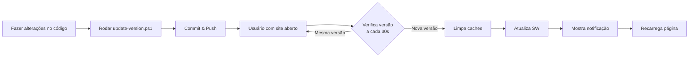

# 🔄 Sistema de Auto-Atualização

Sistema inteligente que força o navegador a sempre carregar a versão mais recente do site **SEM PRECISAR LIMPAR CACHE MANUALMENTE**.

## 🎯 Como Funciona

O sistema possui 3 componentes principais:

1. **`version.json`** - Arquivo que guarda a versão atual do site
2. **`js/auto-updater.js`** - Script que monitora e força atualizações
3. **`update-version.ps1`** - Script PowerShell para automatizar versionamento
4. **`sw.js`** - Service Worker melhorado com suporte a auto-update

## 🚀 Como Usar

### Toda vez que você fizer alterações no site:

#### **Opção 1: PowerShell (Recomendado para Windows)**
```powershell
# Atualização patch (1.0.10 → 1.0.11)
.\update-version.ps1

# Ou especifique o tipo:
.\update-version.ps1 patch   # 1.0.10 → 1.0.11
.\update-version.ps1 minor   # 1.0.10 → 1.1.0  
.\update-version.ps1 major   # 1.0.10 → 2.0.0

# Depois faça commit e push normalmente
git add .
git commit -m "sua mensagem"
git push
```

#### **Opção 2: Manual (se não quiser usar o script)**

Edite o arquivo `version.json` e mude a versão:

```json
{
  "version": "1.0.11",  ← Incrementa isso
  "buildDate": "2026-01-11T22:40:00Z",
  "hash": "104655f",
  "forceUpdate": true
}
```

## ✨ O Que Acontece Automaticamente

1. **Verificação contínua**: A cada 30 segundos, o site verifica se há nova versão
2. **Detecção inteligente**: Quando você atualiza o `version.json`, todos os usuários são notificados
3. **Limpeza automática**: Remove automaticamente todos os caches antigos (Cache API + sessionStorage)
4. **Service Worker atualizado**: Força atualização do SW automaticamente
5. **Notificação visual**: Mostra um banner bonito com gradiente turquesa informando o usuário
6. **Reload suave**: Recarrega a página automaticamente com a nova versão

## 🎨 Experiência do Usuário

Quando há uma atualização disponível:

```
┌─────────────────────────────────────────┐
│ 🔄 Atualizando para versão mais recente...│
└─────────────────────────────────────────┘
```

- Banner aparece no canto superior direito
- Design com gradiente turquesa (#01dba2 → #a9d9df)
- Animação suave de entrada
- Desaparece após 3 segundos
- Página recarrega automaticamente

## 🔧 Funcionalidades Avançadas

### Debug no Console

Abra o console do navegador (F12) para ver os logs:

```javascript
[AutoUpdater] Inicializando sistema de auto-atualização...
[AutoUpdater] Versão do servidor: 1.0.11
[AutoUpdater] Versão local: 1.0.10
[AutoUpdater] 🔄 Nova versão detectada! Atualizando...
[AutoUpdater] Limpando caches...
[AutoUpdater] ✅ Caches limpos
[AutoUpdater] Recarregando página com nova versão...
```

### Forçar Atualização Manual

Se necessário, você pode forçar atualização via console:

```javascript
// No console do navegador (F12)
AutoUpdater.forceUpdate()
```

## 📋 Workflow Completo



## ⚡ Vantagens

✅ **Fim do Ctrl+F5**: Usuários nunca mais precisam limpar cache manualmente  
✅ **Sempre atualizado**: Todos os usuários na versão mais recente em até 30 segundos  
✅ **Transparente**: Processo automático, usuário só vê notificação bonita  
✅ **Funciona sempre**: Mesmo com cache agressivo do navegador  
✅ **Zero configuração**: Uma vez instalado, funciona sozinho  
✅ **Mobile-friendly**: Funciona perfeitamente em dispositivos móveis  
✅ **Detecta retorno**: Quando usuário volta para a aba, verifica imediatamente  

## 🐛 Troubleshooting

### O sistema não está funcionando?

1. **Verifique o console** (F12) para ver os logs do AutoUpdater
2. **Certifique-se** que o `version.json` está acessível em `/version.json`
3. **Limpe manualmente** uma vez: Ctrl+Shift+Delete → Limpar tudo
4. **Force atualização**: `AutoUpdater.forceUpdate()` no console

### Como saber se está ativo?

```javascript
// No console (F12):
window.AutoUpdater
// Deve retornar: {config: {...}, state: {...}, init: ƒ, ...}
```

## 📊 Estatísticas

- **Intervalo de verificação**: 30 segundos
- **Delay de reload**: 1 segundo (para usuário ver notificação)
- **Tentativas de retry**: 3 (caso falhe a verificação)
- **Cache lifetime**: Infinito até nova versão ser detectada

## 🎯 Exemplo Prático

```bash
# 1. Você faz uma alteração no CSS
# 2. Atualiza a versão
PS> .\update-version.ps1 patch
✅ Versão atualizada: 1.0.10 → 1.0.11

# 3. Commit e push
PS> git add .
PS> git commit -m "fix: corrigir padding do header"
PS> git push

# 4. Usuários com o site aberto receberão automaticamente:
#    - Notificação visual após ≤30s
#    - Cache limpo automaticamente
#    - Página recarregada com nova versão
#    - Tudo sem precisar fazer NADA!
```

## 🌟 Resultado Final

**ANTES** (sem auto-updater):
- ❌ Usuário vê versão antiga
- ❌ Precisa apertar Ctrl+F5
- ❌ Ou ir em configurações limpar cache
- ❌ Confusão e frustração

**DEPOIS** (com auto-updater):
- ✅ Usuário sempre vê versão mais recente
- ✅ Totalmente automático
- ✅ Notificação bonita
- ✅ Zero trabalho manual

---

**Desenvolvido com ❤️ para garantir que seus usuários sempre tenham a melhor experiência!**
